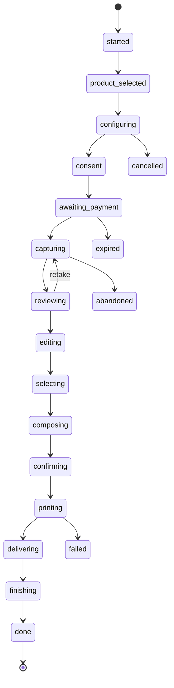

# Sesiones y privacidad

Ciclo de vida de una sesión de cliente, qué se persiste y dónde, políticas de retención, consentimientos y recuperación ante interrupciones. Las formas viven en `packages/contracts/src/sessions.ts` y `station-api.ts`; la máquina de estados y las reglas de retención en `packages/domain/src/sessions.ts`. El protocolo completo de rutas está en `docs/protocolos/station-api-v1.md`.

## 1. Ciclo de sesión

*(simplificado: desde cualquier etapa no terminal se puede cancelar, fallar, expirar o abandonar; el grafo completo, con los caminos hacia atrás de revisión/edición/selección, está en `docs/protocolos/station-api-v1.md` §3).* Las etapas terminales son `done`, `cancelled`, `failed`, `expired`, `abandoned` (`TERMINAL_STAGES`); ninguna tiene salida.

## 2. Dónde se persiste qué

| Qué | Dónde | Sale de la máquina? |
|---|---|---|
| Fotografías (capturas, ediciones, composición) | `var/station/<machineId>/sessions/<sessionId>/` (archivos) | Nunca |
| Sesión completa en curso (`StationSession`) | `station.sqlite` en el agente (tabla de sesiones) | No |
| Trabajos de impresión, incluida la ruta de salida (`PrintJob.outputPath`) | `station.sqlite` + `var/station/<machineId>/prints/` | No — `outputPath` se descarta antes de convertirse en evento |
| `SessionRecord` (metadatos sin fotos) | `station.sqlite` → outbox → `fleet.v1` evento `session_record` → libro de sesiones del control-plane | Sí — es lo único que sale |
| Consentimientos (`ConsentRecord[]`) | Dentro de `StationSession.consents`, y copiados a `SessionRecord.consents` | Sí, como parte del registro |

Esta separación es ADR-003 y ADR-005 aplicados a datos: el agente es la única fuente de verdad de la sesión en curso (principio 2 de `00-vision-general.md`); la nube nunca escribe sobre ella y nunca recibe una imagen.

## 3. Políticas de retención y el reaper

`RetentionMode` (`packages/contracts/src/sessions.ts`): `none`, `temporary`, `period`, `derivatives_only`, `delete_originals`, `metadata_only`. `resolveRetentionPolicy(policies, product, effectiveValues)` elige, en orden: la política del producto (`product.retentionPolicyId`) → la primera que declara ese `ProductKind` en `appliesToKinds` → `privacy.defaultRetentionPolicyId` del efectivo → la primera política disponible → `DEFAULT_RETENTION_POLICY` (`ret_delete_on_finish`, `mode: "none"`, borra también sesiones incompletas) como respaldo final, para que nunca quede sin política.

`retentionDeadline(policy, endedAt)` calcula el instante de borrado:

| `mode` | `deadline` |
|---|---|
| `none`, `delete_originals`, `metadata_only` | `endedAt` (inmediato) |
| `temporary` | `endedAt + durationMinutes` (o inmediato si no hay duración) |
| `period`, `derivatives_only` | `endedAt + durationMinutes`, o `undefined` (sin borrado automático) si no hay duración |

El **reaper** es el proceso periódico del agente (`docs/arquitectura/00-vision-general.md` §4.1) que recorre `var/station/<machineId>/sessions/` y borra lo que ya cumplió su `deadline`, incluidas las sesiones incompletas cuando `privacy.deleteIncompleteSessions` es verdadero. Al borrar, marca `SessionRecord.retention.deletedAt` y reenvía el evento `session_record` actualizado (`fleet-sync-v1.md` §5), de modo que la nube sabe que ya no hay fotografía que pedir aunque nunca la haya tenido.

## 4. Consentimientos

`ConsentKind`: `service` (tratamiento necesario para prestar el servicio, siempre requerido), `storage_optional` (guardar más allá de lo mínimo), `external_future` (envío a un proveedor externo futuro, IA/entrega), `marketing_future`, `campaign` (participación en una campaña patrocinada). Cada uno se registra por separado (`ConsentRecord { kind, given, at, textVersion }`) — nunca agrupados: negar `marketing_future` no puede bloquear `service`. `textVersion` referencia la versión exacta del texto legal que el cliente vio (`legal.privacyNotice`/`legal.terms` del efectivo), para poder reconstruir qué aceptó incluso si el texto cambia después.

## 5. Recuperación de sesión (requisito 31)

El requisito 31 exige poder **distinguir** siete situaciones y, en todas, "resolver la sesión anterior de forma segura y respetar las políticas de privacidad" — no fija una acción distinta por caso. Esta es la resolución concreta que aplica el agente, alineada con `SessionRecord.recoveredFrom` (`app_restart | machine_restart | print_failed | corrupt | incomplete`) y con `00-vision-general.md` §4.4:

| Caso | Cómo lo distingue el agente | Acción |
|---|---|---|
| Sesión abandonada | En vivo: `idleTimeoutSec` se agota sin ninguna petición sobre la sesión | Transición a `abandoned` (no es un caso de arranque); `sessionRecordFrom` registra `result: "abandoned"` y `abandonedAtStage`; el reaper aplica la retención normal |
| Aplicación reiniciada (el kiosco recarga, el agente sigue vivo) | El agente nunca perdió la sesión: sigue en memoria y en `station.sqlite` | `GET /sessions/active` la devuelve tal cual; el kiosco reanuda en `session.stage` sin pedir nada de nuevo (`recoveredFrom` no se usa: no hubo pérdida) |
| Máquina reiniciada (el propio agente se reinicia) | Al arrancar, el agente relee `station.sqlite` y encuentra una sesión no terminal | Si la sesión es reciente y su etapa lo permite, se reanuda igual que arriba con `recoveredFrom: "machine_restart"`; si es de un arranque anterior lejano, se cierra como incompleta (ver abajo) |
| Impresión fallida después de confirmar | `PrintJob.status = "failed"` encontrado al reanudar, con la sesión ya en `confirming`/`printing` | Se ofrece reintento (`POST /sessions/:id/print/:jobId/retry`, misma `idempotencyKey`); si se agotan los reintentos razonables, se abre una `Incident` automática (`source: "auto"`) y la sesión cierra con `recoveredFrom: "print_failed"` |
| Captura guardada temporalmente | Archivos presentes en `sessions/<id>/` con la sesión aún no terminal | Si la sesión se reanuda (casos de arriba), las capturas siguen ahí y se usan tal cual; si no se reanuda, siguen la retención normal de una sesión incompleta — nunca se muestran al siguiente cliente |
| Sesión corrupta | La fila de `station.sqlite` no valida contra `StationSession`/`SessionRecordSchema`, o el archivo de estado está dañado | Cierre inmediato con `MachineEvent` `error`, `recoveredFrom: "corrupt"`, sin intentar reconstruir contenido parcial; el reaper limpia sus archivos |
| Sesión incompleta | Sesión no terminal cuya `updatedAt` excede un margen razonable (arranque de un día anterior, o el caso "máquina reiniciada" lejano de arriba) | Cierre con `result` acorde (`abandoned`/`failed`) y `recoveredFrom: "incomplete"`; `privacy.deleteIncompleteSessions` decide si además se borran sus archivos de inmediato |

En todos los casos rige la misma regla de cierre: **nunca se muestra contenido de una sesión anterior al siguiente cliente** (`00-vision-general.md` §4.4). El kiosco, al montar, siempre pregunta `GET /sessions/active`; si la respuesta es `204`, va a atracción sin excepción.

## 6. Pantalla de finalización y limpieza

Al llegar a `finishing`, `POST /sessions/:id/finish` aplica la política de retención resuelta y devuelve `FinishSessionResponse { session, record, retentionNotice }` (forma completa en `docs/protocolos/station-api-v1.md` §2.7). `retentionNotice` es el texto — derivado de `RetentionPolicy.customerText` — que la pantalla de finalización muestra para decir explícitamente si la fotografía ya se eliminó, cuándo se eliminará, o que sólo quedó el registro de la venta (requisito 23.5). Antes de volver a atracción, el kiosco limpia todo estado visual de la sesión (capturas en memoria del navegador, vista previa, mensajes) — no depende de un borrado en el agente para dejar de mostrar la sesión anterior; son dos mecanismos independientes (UI vs. archivo).

## 7. `photos.view_exceptional`

Ninguna ruta de `admin.v1` ni de `station.v1` sirve una fotografía de cliente (§6 de `docs/protocolos/station-api-v1.md`: la única vía de imagen es `imageBase64` de entrada, nunca de salida hacia la nube). El permiso `photos.view_exceptional` (`packages/contracts/src/rbac.ts`) existe para una vía de soporte deliberadamente excepcional — pensada para depurar un caso concreto directamente en la máquina, con acceso de soporte acotado en el tiempo (`SupportAccess`, requisito 3.4) y auditado — que hoy no tiene ruta implementada. Se documenta como reservado en `docs/arquitectura/06-seguridad.md`; usarlo sin un mecanismo de auditoría explícito sería contradecir el principio de retención mínima (§1.5 del documento de requisitos).

## 8. Estados comerciales y `realMoney: false`

`CommercialState` (`free`, `demo`, `paid_simulated`, `courtesy`, `promotion`, `voided`, `failed`, `paid`) lo calcula `commercialStateFor` a partir de `payment.businessMode`, el `PaymentState` del intento y si la sesión es demo — nunca lo elige el kiosco directamente. Sin un procesador real conectado (ADR-006, requisito 51), un pago aprobado por el terminal mock se registra como `paid_simulated`, no como `paid`: `paid` queda reservado para cuando exista un adaptador real (`docs/arquitectura/05-evolucion-y-nube.md` §3). `CommercialMetrics.realMoney` es literalmente el tipo `false` en el contrato (`z.literal(false)`, `packages/contracts/src/metrics.ts`) — no una bandera que alguien pueda olvidar poner en `true`: es estructuralmente imposible que un reporte de métricas de esta versión afirme haber cobrado dinero real.
