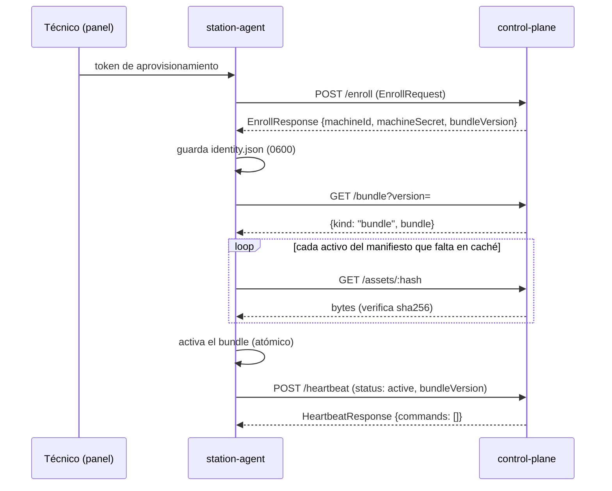
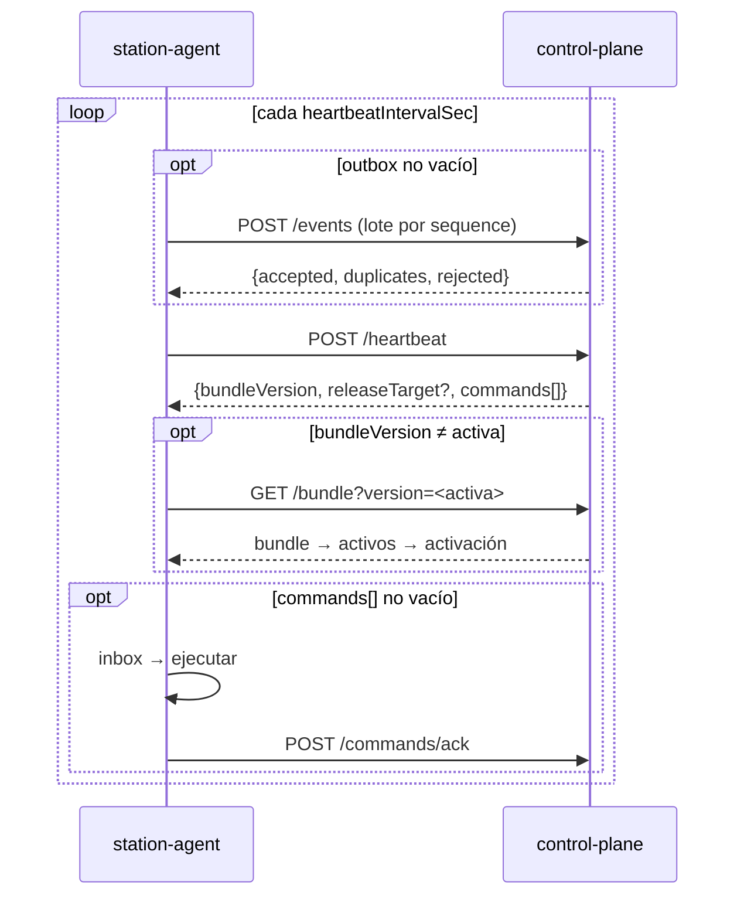
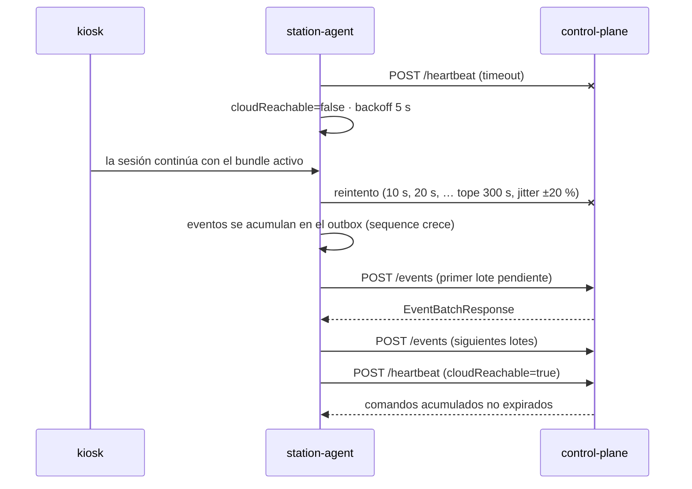
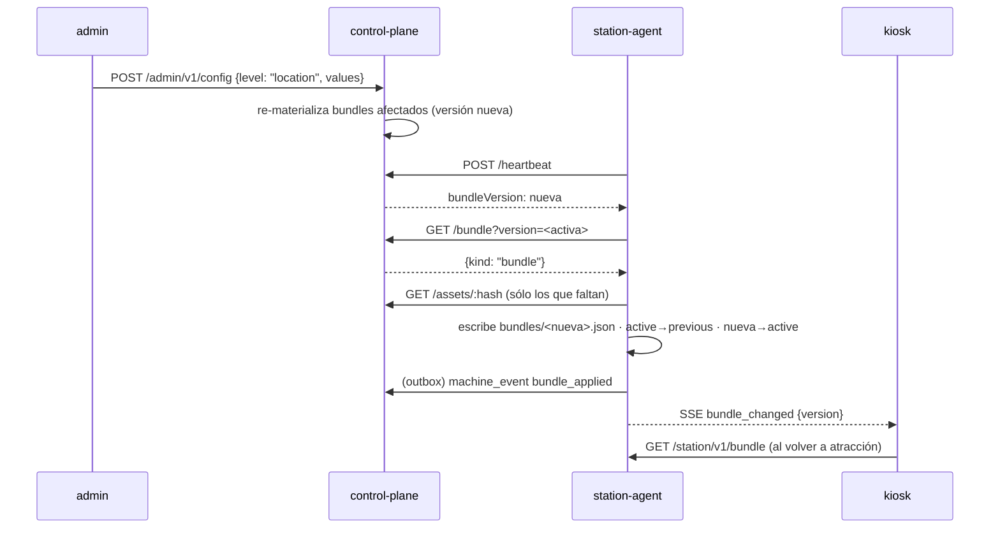

# Protocolo `fleet.v1` · estación ↔ nube

Protocolo entre el agente de estación (`apps/station-agent`) y el plano de control (`apps/control-plane`) bajo `/fleet/v1`. Toda forma de mensaje vive en `packages/contracts/src/fleet-protocol.ts`; este documento explica cómo se usan esas formas, en qué orden y con qué garantías. Los ejemplos JSON validan contra los esquemas indicados en el comentario que los precede.

Principios (ADR-004, ADR-007, ADR-008):

- **Pull.** La máquina inicia toda comunicación. La nube nunca abre conexiones hacia la máquina; los comandos viajan en la respuesta del heartbeat.
- **Idempotencia.** Cada evento y cada comando tiene `id` único. Repetir una entrega no duplica efectos.
- **Autonomía.** Ninguna ruta de este protocolo es necesaria para atender a un cliente. Sin nube, el agente opera con el último bundle activado.
- **Sin fotografías.** Ningún mensaje transporta imágenes. `FleetEvent.print_job` omite `outputPath`; `SessionRecord` descarta cualquier clave desconocida al validarse.

## 1. Convenciones

| Aspecto | Regla |
|---|---|
| Base | `https://<control-plane>/fleet/v1` (desarrollo: `http://localhost:4000/fleet/v1`) |
| Formato | JSON UTF-8, `Content-Type: application/json`; `GET /assets/:hash` devuelve bytes |
| Validación | El control-plane valida cada cuerpo con `safeParse` del esquema correspondiente; un cuerpo inválido responde `400` con `ApiError.code = "validation_error"` y el detalle de zod en `details` |
| Autenticación | `Authorization: Machine <machineId>:<machineSecret>` en toda ruta salvo `POST /enroll` |
| Versión de contratos | Cabecera `X-PSP-Contracts: v1` en cada petición; la respuesta la repite. Ver §8 |
| Tiempo | Toda marca es `Timestamp` (ISO 8601 con zona). La máquina envía además `localTime` y `timezone` en el heartbeat para que la nube razone en hora local |
| Tamaños | Un lote de eventos lleva entre 1 y 1 000 eventos (contrato); el agente usa `sync.eventBatchSize` (por defecto 100) |

### 1.1 Credencial de máquina

En esta fase la credencial es un secreto compartido emitido en el enrolamiento (`EnrollResponse.machineSecret`). El agente lo guarda en `var/station/<machineId>/identity.json` con permisos `0600`; el control-plane guarda sólo su hash y compara en tiempo constante. El secreto nunca aparece en logs, en el panel técnico ni en eventos. Su evolución a mTLS y tokens rotados está en §9.

### 1.2 Errores

Toda respuesta de error es un `ApiError`:

<!-- contract: ApiError -->
```json
{
  "code": "machine_unauthorized",
  "message": "Credencial de máquina inválida o revocada.",
  "incidentCode": "FL-7Q2K"
}
```

| HTTP | `code` | Cuándo | Reacción del agente |
|---|---|---|---|
| 400 | `validation_error` | El cuerpo no valida contra el esquema | Registra el detalle; si es un lote de eventos, reintenta sin los eventos que la nube rechazó individualmente |
| 401 | `machine_unauthorized` | Credencial ausente, inválida o revocada | Pasa a modo autónomo con aviso `cloud_unauthorized` en `StationStatus.notices`; no reintenta hasta que un técnico vuelva a enrolar |
| 403 | `enroll_token_invalid` | Token de aprovisionamiento desconocido, vencido o ya usado | Muestra el error en el panel técnico; espera un token nuevo |
| 404 | `not_found` | Activo o versión de bundle inexistente | Reporta `bundle_failed`; conserva el bundle activo |
| 409 | `machine_retired` | La máquina está `retired` | Deja de enviar heartbeats hasta reinicio manual |
| 426 | `contracts_unsupported` | La nube no sirve la versión de contratos pedida | Mantiene operación local; muestra aviso en el panel técnico |
| 429 | `rate_limited` | Demasiadas peticiones | Aplica el backoff de §3.3 |
| 5xx | `internal` | Error de la nube; `incidentCode` para soporte | Backoff y reintento |

## 2. Rutas

| Método | Ruta | Cuerpo | Respuesta | Auth |
|---|---|---|---|---|
| POST | `/enroll` | `EnrollRequest` | `EnrollResponse` | token de aprovisionamiento (en el cuerpo) |
| POST | `/heartbeat` | `HeartbeatRequest` | `HeartbeatResponse` | Machine |
| GET | `/bundle?version=<actual>` | — | `BundleResponse` (`unchanged` \| `bundle`) | Machine |
| GET | `/assets/:hash` | — | bytes + `Content-Type` | Machine |
| POST | `/events` | `EventBatchRequest` | `EventBatchResponse` | Machine |
| POST | `/commands/ack` | `CommandAck[]` | `204` | Machine |
| GET | `/release` | — | `ReleaseTarget` \| `204` | Machine |

### 2.1 `POST /enroll`

Primer contacto de una máquina. El token de aprovisionamiento lo genera un administrador al crear la máquina en `/admin/v1/machines` y se introduce en el panel técnico; es de un solo uso y expira. El reporte de hardware permite a la nube proponer el perfil (`hardwareProfileHint`) y sembrar las capacidades iniciales.

<!-- contract: EnrollRequest -->
```json
{
  "provisioningToken": "prov-9Q4K-7H2M-XZ81",
  "report": {
    "hostname": "psp-doc-01",
    "platform": "linux-x64",
    "softwareVersion": "0.4.2",
    "hardwareProfileHint": "hwp_doc_station",
    "capabilities": [
      { "key": "camera.primary", "present": true, "operational": true, "detail": "USB 1920x1080" },
      { "key": "display.touch", "present": true, "operational": true },
      { "key": "printer.photo", "present": true, "operational": true, "detail": "prn_photo_1" },
      { "key": "printer.color", "present": true, "operational": true },
      { "key": "lighting.controllable", "present": true, "operational": true },
      { "key": "payment.terminal", "present": true, "operational": true, "detail": "mock" },
      { "key": "connectivity.online", "present": true, "operational": true },
      { "key": "storage.local", "present": true, "operational": true, "detail": "51200 MB libres" },
      { "key": "audio.output", "present": true, "operational": true }
    ]
  }
}
```

<!-- contract: EnrollResponse -->
```json
{
  "machineId": "mch_demo_doc_01",
  "machineSecret": "EJEMPLO-NO-ES-UN-SECRETO-REAL",
  "organizationId": "org_lumina",
  "heartbeatIntervalSec": 30,
  "bundleVersion": "73449d42e9b6b083761e50cfdf6fbe631946f4c12dd02ac8e5c64eaedeb2850f"
}
```

`bundleVersion` es la versión que la nube ya materializó para esta máquina; si falta, la máquina pide el bundle igualmente con `version` vacío. Tras enrolar, la nube registra el `MachineEvent` `enrolled` y la máquina pasa de `configuring` a `active` en cuanto activa su primer bundle.

### 2.2 `POST /heartbeat`

Latido periódico con el estado completo de la máquina. Es la única ruta obligatoria en operación normal: trae comandos, versión objetivo de bundle y release, y el intervalo del siguiente latido.

<!-- contract: HeartbeatRequest -->
```json
{
  "machineId": "mch_demo_doc_01",
  "at": "2026-09-09T14:30:05Z",
  "localTime": "08:30",
  "timezone": "America/Mexico_City",
  "softwareVersion": "0.4.2",
  "bundleVersion": "73449d42e9b6b083761e50cfdf6fbe631946f4c12dd02ac8e5c64eaedeb2850f",
  "status": "active",
  "capabilities": [
    { "key": "camera.primary", "present": true, "operational": true, "updatedAt": "2026-09-09T13:00:00Z" },
    { "key": "printer.photo", "present": true, "operational": true, "detail": "prn_photo_1" },
    { "key": "payment.terminal", "present": true, "operational": true, "detail": "mock" },
    { "key": "connectivity.online", "present": true, "operational": true }
  ],
  "printers": [
    {
      "id": "prn_photo_1",
      "name": "Impresora fotográfica",
      "type": "photo",
      "paperSizes": ["4x6in", "5x7in"],
      "color": true,
      "consumableType": "photo_paper",
      "priority": 0,
      "status": "ready",
      "paperEstimate": 212,
      "lastJobAt": "2026-09-09T14:12:40Z"
    }
  ],
  "consumables": [{ "type": "photo_paper", "estimatedRemaining": 212, "unit": "prints" }],
  "health": {
    "cpuPct": 12.5,
    "memPct": 41,
    "diskFreeMb": 51200,
    "storagePct": 22.4,
    "temperatureC": 41,
    "uptimeSec": 86400,
    "cloudReachable": true
  },
  "release": { "currentVersion": "0.4.2", "status": "up_to_date", "requiresRestart": false },
  "activeSessionId": "ses_01J7Q3X8K2",
  "pendingEvents": 0,
  "maintenance": { "on": false }
}
```

Semántica de los campos que no son obvios:

| Campo | Significado |
|---|---|
| `status` | Estado operativo que la máquina cree tener. La nube puede corregirlo con `statusOverride` |
| `release` | `MachineReleaseState` sin `machineId` ni `updatedAt`: versión actual, objetivo y estado del ciclo (§7) |
| `pendingEvents` | Tamaño del outbox. Un valor alto sostenido señala un problema de sincronización y aparece en el dashboard |
| `lastError` | Último error operativo en una línea, sin datos personales |
| `health.cloudReachable` | Lo que la máquina midió en su último intento; útil cuando el heartbeat llega tras una reconexión |
| `maintenance` | Modo mantenimiento activado localmente o por comando, con el mensaje público |

<!-- contract: HeartbeatResponse -->
```json
{
  "serverTime": "2026-09-09T14:30:05.412Z",
  "heartbeatIntervalSec": 30,
  "bundleVersion": "d8832a1b44e0743b0465f2c7daa51efa12d7c5538fbc27240b46adaeb465ab87",
  "releaseTarget": {
    "releaseId": "rel_0_5_0",
    "rolloutId": "rlt_piloto_norte",
    "version": "0.5.0",
    "channel": "pilot",
    "artifactHash": "7048f008d29e8170a774756d5f5a8dae9e1238932af5d610de4e413a79c2206d",
    "requiresRestart": true,
    "windowStartLocal": "02:00",
    "windowEndLocal": "05:00"
  },
  "commands": [
    {
      "id": "cmd_01J7Q4A0M1",
      "type": "set_maintenance",
      "issuedAt": "2026-09-09T14:29:50Z",
      "issuedBy": "usr_tecnico_norte",
      "expiresAt": "2026-09-09T15:29:50Z",
      "reason": "Cambio de papel programado",
      "on": true,
      "message": "Volvemos en 10 minutos"
    },
    {
      "id": "cmd_01J7Q4A0M2",
      "type": "run_test",
      "issuedAt": "2026-09-09T14:29:55Z",
      "kind": "print"
    }
  ]
}
```

| Campo | Qué hace el agente |
|---|---|
| `serverTime` | Calcula la desviación de reloj; si supera 60 s la muestra en el panel técnico. Nunca ajusta el reloj del sistema |
| `heartbeatIntervalSec` | Programa el siguiente latido. Viene de `sync.heartbeatIntervalSec` del efectivo de la máquina |
| `bundleVersion` | Si difiere de la activa, inicia el ciclo de bundle (§6) |
| `releaseTarget` | Si difiere de `release.currentVersion` y no hay ciclo en curso, inicia el ciclo de release (§7). Es el mismo objeto que devuelve `GET /release` |
| `commands` | Los persiste en el inbox (deduplicando por `id`) y los ejecuta en orden de `issuedAt` (§4) |
| `statusOverride` | Adopta ese estado administrativo (`suspended`, `demo`, `storage`, `retired`…) y lo reporta en el siguiente latido. A diferencia de `set_status`, no se confirma: es el estado deseado persistente que la nube repite mientras aplique |

La nube incluye un comando en cada respuesta hasta recibir su `CommandAck` o hasta que expire; el agente lo ejecuta una sola vez porque el inbox lo recuerda por `id`.

### 2.3 `GET /bundle?version=<actual>`

`version` es la versión activa en la máquina (vacío en el primer arranque). La nube responde `unchanged` cuando coincide con la versión materializada para la máquina; de lo contrario devuelve el bundle completo.

<!-- contract: BundleResponse -->
```json
{ "kind": "unchanged", "version": "73449d42e9b6b083761e50cfdf6fbe631946f4c12dd02ac8e5c64eaedeb2850f" }
```

Un bundle (colecciones de catálogo vacías por brevedad; en una máquina real llevan productos, precios, presets, plantillas, experiencias y campañas):

<!-- contract: BundleResponse -->
```json
{
  "kind": "bundle",
  "bundle": {
    "version": "d8832a1b44e0743b0465f2c7daa51efa12d7c5538fbc27240b46adaeb465ab87",
    "contractsVersion": "v1",
    "machineId": "mch_demo_doc_01",
    "organizationId": "org_lumina",
    "generatedAt": "2026-09-09T14:29:30Z",
    "basedOn": {
      "layerIds": ["cfg_platform", "cfg_org_lumina", "cfg_fr_norte", "cfg_loc_uni_norte", "cfg_mch_demo_doc_01"],
      "campaignIds": ["cmp_regreso_clases"],
      "catalogRevision": "cat_000123"
    },
    "organization": {
      "id": "org_lumina",
      "name": "Lumina",
      "slug": "lumina",
      "currency": "MXN",
      "defaultLocale": "es",
      "locales": ["es", "en"],
      "timezone": "America/Mexico_City",
      "country": "MX",
      "support": { "phone": "+52 55 0000 0000" }
    },
    "location": {
      "id": "loc_uni_norte",
      "publicName": "Universidad Norte · Biblioteca",
      "internalName": "UNI-NORTE-BIB",
      "timezone": "America/Mexico_City",
      "type": "university",
      "address": { "line1": "Av. Universidad 100", "city": "Monterrey", "country": "MX" }
    },
    "machine": {
      "id": "mch_demo_doc_01",
      "code": "DOC-01",
      "name": "Estación documental 01",
      "timezone": "America/Mexico_City",
      "releaseChannel": "stable",
      "printers": [
        {
          "id": "prn_photo_1",
          "name": "Impresora fotográfica",
          "type": "photo",
          "paperSizes": ["4x6in", "5x7in"],
          "color": true,
          "consumableType": "photo_paper",
          "priority": 0
        }
      ]
    },
    "hardwareProfile": {
      "id": "hwp_doc_station",
      "organizationId": "org_lumina",
      "name": "Estación documental",
      "camera": { "type": "usb_webcam", "count": 1, "resolution": { "width": 1920, "height": 1080 }, "orientation": "landscape" },
      "printers": [
        {
          "id": "prn_photo_1",
          "name": "Impresora fotográfica",
          "type": "photo",
          "paperSizes": ["4x6in", "5x7in"],
          "color": true,
          "consumableType": "photo_paper",
          "priority": 0
        }
      ],
      "paperSizes": ["4x6in", "5x7in"],
      "display": { "touch": true, "resolution": { "width": 1080, "height": 1920 }, "orientation": "portrait" },
      "lighting": true,
      "storageMinGb": 64,
      "peripherals": [],
      "paymentReader": true,
      "audio": true,
      "sensors": [],
      "expectedCapabilities": [
        "camera.primary",
        "display.touch",
        "printer.photo",
        "printer.color",
        "lighting.controllable",
        "payment.terminal",
        "connectivity.online",
        "storage.local",
        "audio.output"
      ],
      "version": 1,
      "createdAt": "2026-01-15T00:00:00Z"
    },
    "effective": {
      "values": {
        "branding.palette.primary": "#1E5EFF",
        "branding.publicName": "Lumina Fotos",
        "timing.idleTimeoutSec": 60
      },
      "provenance": {
        "branding.palette.primary": { "level": "organization", "entityId": "org_lumina", "layerId": "cfg_org_lumina", "isDefault": false },
        "branding.publicName": { "level": "organization", "entityId": "org_lumina", "layerId": "cfg_org_lumina", "isDefault": false },
        "timing.idleTimeoutSec": { "level": "platform", "isDefault": true }
      },
      "locks": {
        "branding.palette.primary": { "key": "branding.palette.primary", "policy": "mandatory", "setBy": "organization", "setById": "org_lumina" }
      },
      "rejected": [],
      "hash": "3f0a9c2d5e7b1a4c6d8e0f2a4b6c8d0e1f3a5b7c9d1e3f5a7b9c1d3e5f7a9b1c"
    },
    "products": [],
    "prices": [],
    "promotions": [],
    "presets": [],
    "presetVersions": [],
    "templates": [],
    "experiences": [],
    "editingPresets": [],
    "campaigns": [],
    "features": [
      { "key": "documents.mode", "mode": "enabled", "source": "default" },
      { "key": "ai.experiences", "mode": "coming_soon", "source": "default" }
    ],
    "retentionPolicies": [
      {
        "id": "ret_delete_on_finish",
        "name": { "es": "Eliminar al terminar", "en": "Delete on finish" },
        "mode": "none",
        "deleteIncomplete": true,
        "appliesToKinds": [],
        "customerText": { "es": "Tus fotos se procesan en esta máquina y se eliminan al terminar la sesión." },
        "leavesDevice": false
      }
    ],
    "maintenanceChecklists": [],
    "assets": [
      {
        "assetId": "ast_logo_lumina",
        "hash": "ec166f9e0a78a29d18c1e894d75b0efa7f79cbbb3cfb67d57800f0bd827cbb8a",
        "mime": "image/svg+xml",
        "bytes": 4812,
        "url": "/fleet/v1/assets/ec166f9e0a78a29d18c1e894d75b0efa7f79cbbb3cfb67d57800f0bd827cbb8a"
      }
    ]
  }
}
```

### 2.4 `GET /assets/:hash`

Descarga content-addressed. `:hash` es el sha256 hexadecimal del contenido (el mismo de `Asset.hash` y `AssetManifestEntry.hash`). La respuesta lleva `Content-Type` con el `mime` del activo, `Content-Length`, `ETag: "<hash>"` y `Cache-Control: immutable, max-age=31536000`: el contenido de un hash nunca cambia, así que el agente no revalida lo que ya tiene. El agente verifica el sha256 de los bytes recibidos antes de guardarlos en `var/station/<machineId>/assets/<hash>` y descarta el archivo si no coincide (`bundle_failed` con motivo `asset_hash_mismatch`).

Los artefactos de software de una release (`ReleaseTarget.artifactHash`) se descargan por esta misma ruta: son bytes identificados por su hash, como cualquier activo.

```http
GET /fleet/v1/assets/ec166f9e0a78a29d18c1e894d75b0efa7f79cbbb3cfb67d57800f0bd827cbb8a HTTP/1.1
Authorization: Machine mch_demo_doc_01:<machineSecret>
X-PSP-Contracts: v1

HTTP/1.1 200 OK
Content-Type: image/svg+xml
Content-Length: 4812
ETag: "ec166f9e0a78a29d18c1e894d75b0efa7f79cbbb3cfb67d57800f0bd827cbb8a"
Cache-Control: immutable, max-age=31536000
```

### 2.5 `POST /events`

Envío del outbox en lote. Los eventos van ordenados por `sequence` ascendente. La nube valida el sobre (`machineId`, `events` como arreglo) y después **cada evento por separado**, de modo que un evento inválido o de tipo desconocido cae en `rejected` sin invalidar el lote.

<!-- contract: EventBatchRequest -->
```json
{
  "machineId": "mch_demo_doc_01",
  "events": [
    {
      "id": "evt_01J7Q3Z0A1",
      "machineId": "mch_demo_doc_01",
      "at": "2026-09-09T14:23:41Z",
      "sequence": 5120,
      "softwareVersion": "0.4.2",
      "bundleVersion": "73449d42e9b6b083761e50cfdf6fbe631946f4c12dd02ac8e5c64eaedeb2850f",
      "type": "session_record",
      "payload": {
        "id": "ses_01J7Q3X8K2",
        "code": "K7M3PQ",
        "machineId": "mch_demo_doc_01",
        "locationId": "loc_uni_norte",
        "organizationId": "org_lumina",
        "franchiseId": "fr_norte",
        "startedAt": "2026-09-09T14:20:11Z",
        "endedAt": "2026-09-09T14:23:40Z",
        "stage": "done",
        "result": "completed",
        "productId": "prd_doc_credencial",
        "productName": "Foto para credencial universitaria",
        "productKind": "document",
        "presetId": "pst_uni_norte_credencial",
        "presetVersion": 3,
        "templateId": "tpl_doc_sheet_4x6",
        "templateVersion": 2,
        "captures": 2,
        "retakes": 1,
        "printsRequested": 1,
        "printsCompleted": 1,
        "durationSec": 209,
        "commercial": {
          "state": "paid_simulated",
          "listPrice": { "amount": 8000, "currency": "MXN" },
          "finalPrice": { "amount": 8000, "currency": "MXN" },
          "promotionIds": [],
          "paymentState": "approved",
          "paymentRef": "mock-000123",
          "adapter": "mock"
        },
        "softwareVersion": "0.4.2",
        "bundleVersion": "73449d42e9b6b083761e50cfdf6fbe631946f4c12dd02ac8e5c64eaedeb2850f",
        "errors": [],
        "consents": [{ "kind": "service", "given": true, "at": "2026-09-09T14:20:40Z", "textVersion": "privacy-es-2026-03" }],
        "retention": {
          "policyId": "ret_delete_on_finish",
          "mode": "none",
          "deleteAt": "2026-09-09T14:23:40Z",
          "deletedAt": "2026-09-09T14:23:41Z"
        },
        "isDemo": false,
        "operatorStarted": false,
        "locale": "es",
        "editingUsed": true,
        "editingTools": ["brightness"]
      }
    },
    {
      "id": "evt_01J7Q3Z0A2",
      "machineId": "mch_demo_doc_01",
      "at": "2026-09-09T14:23:40Z",
      "sequence": 5121,
      "softwareVersion": "0.4.2",
      "type": "machine_event",
      "payload": {
        "id": "mev_01J7Q3Z0A2",
        "machineId": "mch_demo_doc_01",
        "at": "2026-09-09T14:23:40Z",
        "type": "session_completed",
        "severity": "info",
        "message": "Sesión K7M3PQ completada: 1 impresión",
        "sessionId": "ses_01J7Q3X8K2"
      }
    },
    {
      "id": "evt_01J7Q3Z0A3",
      "machineId": "mch_demo_doc_01",
      "at": "2026-09-09T14:23:12Z",
      "sequence": 5122,
      "softwareVersion": "0.4.2",
      "type": "print_job",
      "payload": {
        "id": "prj_01J7Q3YQ77",
        "sessionId": "ses_01J7Q3X8K2",
        "machineId": "mch_demo_doc_01",
        "printerId": "prn_photo_1",
        "copies": 1,
        "status": "completed",
        "attempt": 1,
        "idempotencyKey": "ses_01J7Q3X8K2:print:1",
        "isTest": false,
        "createdAt": "2026-09-09T14:22:50Z",
        "completedAt": "2026-09-09T14:23:12Z"
      }
    }
  ]
}
```

<!-- contract: EventBatchResponse -->
```json
{
  "accepted": ["evt_01J7Q3Z0A1", "evt_01J7Q3Z0A3"],
  "duplicates": ["evt_01J7Q3Z0A2"],
  "rejected": []
}
```

Tratamiento en el agente: `accepted` y `duplicates` se marcan entregados (`deliveredAt`); `rejected` se marcan rechazados con su motivo, salen de la cola y quedan 7 días visibles en el panel técnico. Un evento rechazado nunca se reintenta: su forma no va a cambiar.

### 2.6 `POST /commands/ack`

Confirmación explícita de comandos. Se envía inmediatamente después de ejecutar cada comando (o en lote si varios terminan juntos). Responde `204`. El mismo `CommandAck` viaja también como evento `command_ack` en el outbox, de modo que la confirmación llega aunque esta ruta falle por falta de red; la nube trata ambas vías de forma idempotente por `commandId`.

<!-- contract: CommandAck[] -->
```json
[
  { "commandId": "cmd_01J7Q4A0M1", "machineId": "mch_demo_doc_01", "result": "ok", "at": "2026-09-09T14:30:06Z" },
  {
    "commandId": "cmd_01J7Q4A0M2",
    "machineId": "mch_demo_doc_01",
    "result": "failed",
    "message": "printer_no_paper: prn_photo_1",
    "at": "2026-09-09T14:30:09Z"
  }
]
```

| `result` | Significado |
|---|---|
| `ok` | Ejecutado con efecto |
| `failed` | Intentado y fallido; `message` lleva el motivo en una línea |
| `expired` | `expiresAt` ya había pasado al recibirlo o al ir a ejecutarlo |
| `skipped` | Precondición no cumplida sin error: ya estaba en ese estado, no hay sesiones que limpiar, no hay kiosco conectado para una prueba de navegador |

### 2.7 `GET /release`

Devuelve el `ReleaseTarget` vigente para la máquina o `204` si no hay ninguno. El agente lo consulta al arrancar y tras un ciclo fallido; en operación normal el mismo objeto llega en `HeartbeatResponse.releaseTarget`.

<!-- contract: ReleaseTarget -->
```json
{
  "releaseId": "rel_0_5_0",
  "rolloutId": "rlt_piloto_norte",
  "version": "0.5.0",
  "channel": "pilot",
  "artifactHash": "7048f008d29e8170a774756d5f5a8dae9e1238932af5d610de4e413a79c2206d",
  "requiresRestart": true,
  "windowStartLocal": "02:00",
  "windowEndLocal": "05:00"
}
```

## 3. Secuencias

### 3.1 Primer arranque



Sin nube en el primer arranque, el agente arranca en modo *standalone* con el bundle del dataset demo (`packages/fixtures`) y reintenta el enrolamiento con backoff en cuanto el técnico introduce un token.

### 3.2 Operación normal



El outbox se vacía **antes** del heartbeat para que `pendingEvents` refleje lo que de verdad queda pendiente y para que la nube tenga los registros antes de decidir comandos.

### 3.3 Pérdida de conexión



Reglas del outbox:

- **Persistencia.** Cada evento se escribe en la base local (`events` con `deliveredAt`) antes de que la operación que lo produce se dé por terminada. Un reinicio no pierde eventos.
- **Orden.** `sequence` es un contador monótono por máquina, persistido. Los lotes se forman con los eventos no entregados más antiguos, en orden.
- **Idempotencia.** `id` es único por evento. Reenviar un lote tras un timeout produce `duplicates`, nunca duplicados en la nube.
- **Backoff.** Fallo de red o `5xx`/`429`: espera inicial 5 s, factor 2, tope 300 s, jitter ±20 %. El heartbeat sigue el mismo backoff; al primer éxito vuelve a `heartbeatIntervalSec`.
- **Prioridad al reconectar.** Primero todos los lotes pendientes, después el heartbeat. Los comandos que expiraron mientras la máquina estaba desconectada ya no llegan; los que siguen vigentes llegan en el primer heartbeat.
- **Límites.** Con `pendingEvents` por encima de 10 000, el agente conserva los eventos pero sube un aviso `outbox_backlog` en el panel técnico y en `lastError`; nunca descarta eventos por su cuenta.

### 3.4 Comandos

```mermaid
sequenceDiagram
  participant Ad as admin
  participant C as control-plane
  participant A as station-agent
  participant K as kiosk
  Ad->>C: POST /admin/v1/machines/:id/commands {command, reason}
  C->>C: comando pending (id, expiresAt) + auditoría
  A->>C: POST /heartbeat
  C-->>A: commands: [comando]
  A->>A: inbox (dedupe por id) · ¿expirado?
  A->>A: ejecuta (p. ej. set_maintenance)
  A-->>K: SSE maintenance {on, message}
  A->>C: POST /commands/ack [{result: "ok"}]
  A->>C: (outbox) machine_event command_executed
  C->>C: comando acked; deja de enviarse
```

Un comando con `expiresAt` en el pasado se confirma como `expired` y no se ejecuta. Sin `expiresAt`, el comando no caduca; la nube aplica por defecto 24 h al crearlo desde administración.

### 3.5 Releases

```mermaid
sequenceDiagram
  participant C as control-plane
  participant A as station-agent
  C-->>A: heartbeat: releaseTarget 0.5.0 + apply_release
  A->>C: ack apply_release ok · release_status pending
  A->>C: GET /assets/<artifactHash>
  A->>C: release_status downloading → ready (hash verificado)
  A->>A: espera ventana local 02:00–05:00 y sesión inactiva
  A->>C: release_status installing
  A->>A: instala; reinicia si requiresRestart
  A->>C: heartbeat softwareVersion 0.5.0 · release_status completed
  Note over A,C: si falla: release_status failed → rollback automático a 0.4.2 → rolled_back
```

### 3.6 Bundles



## 4. Comandos

Todos comparten `id`, `issuedAt`, `issuedBy?`, `expiresAt?`, `reason?`. El agente registra cada recepción como `MachineEvent` `command_received` y cada ejecución como `command_executed` (o `error` si falla). Los comandos `apply_release`, `rollback_release` y `pause_release` los genera el motor de rollouts; `POST /admin/v1/machines/:id/commands` los rechaza con `400 command_reserved`.

| Tipo | Parámetros | Efecto en la máquina | Ack |
|---|---|---|---|
| `set_maintenance` | `on`, `message?` | Activa o desactiva el modo mantenimiento. Los productos quedan no disponibles con motivo `maintenance`; el kiosco muestra `message` (o el texto por defecto) al terminar la sesión activa. Emite `maintenance_on`/`maintenance_off` y SSE `maintenance` | `ok`; `skipped` si ya estaba así |
| `set_status` | `status` | Fija el estado operativo reportado. `out_of_service` muestra la pantalla de fuera de servicio; `demo` activa `demoMode`; `active` restablece. Emite `out_of_service`/`back_in_service` | `ok`; `skipped` si no cambia; `failed` con `retired` (la máquina exige reinstalación) |
| `reload_bundle` | `version?` | Activa `version` desde caché si la tiene; si no (o sin `version`), pide `GET /bundle` y sigue §6. Si faltan activos y no se pueden descargar, conserva el bundle activo | `ok` al activar; `failed` con el motivo |
| `apply_release` | `releaseId`, `rolloutId`, `version`, `artifactHash`, `windowStartLocal?`, `windowEndLocal?`, `requiresRestart` | Inicia el ciclo de release (§7). `ok` significa aceptado, no instalado: el avance llega por eventos `release_status` | `skipped` si `currentVersion` ya es `version`; `failed` si el artefacto no valida o la release es incompatible |
| `rollback_release` | `toVersion`, `rolloutId` | Reinstala `toVersion` desde la caché local de artefactos (el agente conserva el artefacto de la versión anterior). Sin artefacto en caché responde `failed` y el administrador crea un rollout de esa release | `ok` al terminar (`rolled_back`) |
| `pause_release` | `rolloutId` | Pausa un ciclo en `pending`, `downloading` o `ready` | `ok`; `skipped` si ya está instalando o completado |
| `restart_app` | — | Reinicia agente y kiosco cuando no hay sesión activa (espera al final de la sesión en curso). Emite `restart` al volver | `ok` al programar el reinicio |
| `clear_temp_sessions` | — | Elimina archivos de sesiones no activas: terminadas con retención vencida e incompletas. Nunca toca la sesión activa | `ok` con el conteo en `message`; `skipped` si no hay nada |
| `run_test` | `kind` | Ejecuta la prueba (misma lista que el panel técnico). Las de navegador (`camera`, `preview`, `capture`, `touch`) se delegan al kiosco por SSE `command` | `ok`/`failed` según el resultado; `skipped` sin kiosco conectado |
| `print_test` | — | Imprime el patrón de prueba (`PrintJob.isTest = true`) en la impresora prioritaria | `ok`/`failed` |
| `sync_now` | — | Vacía el outbox y comprueba bundle y release de inmediato | `ok` |
| `capture_diagnostics` | — | Recoge versiones, salud, capacidades, impresoras, últimos errores, estado del outbox y versión de bundle, y lo envía como evento `diagnostics`. Nunca incluye fotografías ni datos de clientes | `ok` |
| `set_local_config` | `values` | Aplica valores locales (sólo claves cuya definición admite `machine` y que no estén bloqueadas), como si un técnico usara `PATCH /tech/config`. Emite `local_config_changed` y `local_audit` | `ok`; `failed` listando las claves rechazadas |
| `suspend` | — | Deja de atender sesiones (pantalla de suspensión), estado `suspended`; sigue enviando heartbeats | `ok` |
| `resume` | — | Vuelve a `active` | `ok` |

Los comandos se ejecutan en serie; uno de larga duración (`apply_release`, `run_test`) no bloquea la confirmación de los demás.

## 5. Eventos

Todos comparten `id`, `machineId`, `at`, `sequence`, `softwareVersion`, `bundleVersion?`. Ninguno lleva fotografías.

| Tipo | `payload` | Cuándo lo emite el agente | Quién lo consume en la nube |
|---|---|---|---|
| `session_record` | `SessionRecord` | Al cerrar una sesión (`done`, `cancelled`, `failed`, `expired`, `abandoned`) y de nuevo cuando el reaper marca `deletedAt` | Libro de sesiones (upsert por `payload.id`), agregados de métricas, dashboard |
| `machine_event` | `MachineEvent` | Cada evento operativo (`session_started`, `print_failed`, `paper_low`, `bundle_applied`, `restart`…) | Línea temporal de la máquina, `needAttention` del dashboard, alertas |
| `release_status` | `MachineReleaseState` | Cada transición del ciclo de release | Estado por máquina del rollout, `stats`, detalle de máquina; el control-plane deriva el `MachineEvent` `release_status` |
| `incident` | `Incident` | Al abrir o cerrar una incidencia desde el panel técnico o automáticamente (`source: "auto"`, p. ej. impresión fallida tras confirmar) | Incidencias (upsert por `payload.id`), `openIncidents` del dashboard |
| `maintenance_log` | `MaintenanceLog` | Acciones `log_maintenance` y `paper_changed` del panel técnico | Bitácora de mantenimiento |
| `consumable_update` | `Consumable` | Cambio de papel y cada vez que la estimación cruza un múltiplo de 10 % | Consumibles, `consumablesAttention` del dashboard |
| `capability_change` | `MachineCapabilityState[]` | Cuando cambia `present` u `operational` de alguna capacidad (lista completa) | `Machine.capabilities`, disponibilidad de productos, alertas de hardware |
| `local_audit` | `AuditEntry` (`origin: "station"`) | Cambio de configuración local, acceso al panel técnico, acciones de mantenimiento | Auditoría global (inmutable) |
| `print_job` | `PrintJob` sin `outputPath` | Cada cambio de estado de un trabajo de impresión | Métricas de impresión, línea temporal |
| `command_ack` | `CommandAck` | Tras ejecutar un comando (vía durable de §2.6) | Estado de comandos |
| `diagnostics` | `JsonValue` | Al ejecutar `capture_diagnostics` | Panel de soporte; se conserva 30 días |

## 6. Bundles

Un `ConfigBundle` es todo lo que la máquina necesita para operar: configuración efectiva con procedencia y bloqueos, catálogo con precios resueltos, promociones, presets y sus versiones, plantillas, experiencias, presets de edición, campañas (con sus ventanas), features resueltas, políticas de retención, checklists y el manifiesto de activos. Es inmutable y `version` es el hash de su contenido (`stableHash` de todo salvo `version` y `generatedAt`; `packages/config-engine`, `buildBundle`).

**Cuándo cambia la versión.** Cuando cambia cualquier insumo que participa en la materialización de esa máquina: una capa de configuración de su cadena (plataforma, organización, blueprint, franquicia, región, ubicación, máquina), un bloqueo, una campaña que la tiene como objetivo (crear, editar, publicar, cancelar, cambiar prioridad u overlay), un producto, precio, promoción o disponibilidad que le aplica, una versión nueva de preset, una plantilla, experiencia o preset de edición, una feature (override, entitlement o plan), una política de retención, un checklist, un activo referenciado (hash nuevo), el perfil de hardware, o los campos de organización, ubicación y máquina que el bundle incluye. La activación de una campaña por fecha **no** cambia la versión: la campaña viaja con `startsAt`/`endsAt` y la máquina la activa en hora local.

**Activación atómica.** El agente escribe `bundles/<version>.json`, comprueba que cada entrada del manifiesto existe en `assets/<hash>` con el hash correcto, y sólo entonces cambia el puntero `active` (el anterior pasa a `previous`). Si falta un activo o falla su descarga, no activa nada, emite `bundle_failed` con el motivo y reintenta en el siguiente heartbeat. Una sesión en curso conserva su `bundleVersion`; el kiosco aplica el bundle nuevo al volver a la pantalla de atracción.

**Bundle anterior.** Se conserva `previous` con sus activos. `reload_bundle` con `version` igual a `previous` es un rollback instantáneo desde caché; un rollback decidido en la nube (reactivar un bundle previo, ADR-007) llega como una versión objetivo distinta y sigue el ciclo normal.

## 7. Releases

Las versiones de software (`Release`, artefacto `station-bundle` con agente + kiosco) se despliegan mediante `Rollout`. La máquina recibe un `ReleaseTarget` y un comando `apply_release`, y reporta su `MachineReleaseState` con cada transición. Las transiciones válidas son las de `nextReleaseStatus` (`packages/domain`):

| Desde | Evento | A | Quién lo provoca |
|---|---|---|---|
| `up_to_date`, `completed`, `failed`, `rolled_back`, `paused`, `pending` | `assign` | `pending` | Llega `apply_release` / `releaseTarget` nuevo |
| `pending` | `download` | `downloading` | El agente empieza a descargar el artefacto |
| `downloading` | `ready` | `ready` | Artefacto en caché con hash verificado |
| `ready` | `install` | `installing` | Dentro de la ventana local (`windowStartLocal`–`windowEndLocal`, admite cruzar medianoche) y sin sesión activa |
| `installing` | `complete` | `completed` | Instalación terminada; `currentVersion = version`; reinicio si `requiresRestart` |
| `pending`, `downloading`, `ready`, `installing` | `fail` | `failed` | Error de descarga, hash, compatibilidad o instalación; `lastResult.ok = false` |
| `completed`, `failed`, `installing` | `rollback` | `rolled_back` | Rollback automático tras `failed` o comando `rollback_release` |
| `pending`, `downloading`, `ready` | `pause` | `paused` | Comando `pause_release` |
| `paused` | `resume` | `pending` | Un `apply_release` posterior del mismo rollout |

Después de `completed`, la nube retira el objetivo cuando el rollout termina y la máquina reporta `up_to_date`. Un `apply_release` con `compatibleFromVersion` mayor que la versión actual responde `failed` sin descargar. `rollback_release` reinstala la versión anterior desde `releases/<artifactHash>` en la caché local (el agente conserva el artefacto de la última versión que funcionó); el resultado se reporta como `rolled_back` con `currentVersion = toVersion`.

## 8. Compatibilidad

- **Aditivo dentro de `v1`.** Sólo se agregan campos opcionales o con default. Nunca se renombra, se elimina ni se cambia el tipo de un campo existente. Un cambio incompatible crea `fleet.v2` bajo `/fleet/v2`, y las máquinas siguen operando con `v1` hasta actualizarse.
- **Cabecera `X-PSP-Contracts: v1`.** Obligatoria en cada petición; declara qué versión de contratos entiende el agente. La nube responde con la misma cabecera y con `426 contracts_unsupported` si no sirve esa versión.
- **Campos desconocidos.** Los esquemas descartan claves desconocidas al validar, así que un agente viejo ignora campos nuevos y una nube vieja ignora campos nuevos del agente.
- **Enumeraciones.** Agregar un valor a una lista cerrada (`FleetCommand.type`, `FleetEvent.type`, `MachineStatus`…) no es aditivo para el consumidor viejo: un `type` desconocido invalida el mensaje. Por eso la nube filtra `commands` por la versión de software reportada (cada tipo de comando declara desde qué versión existe) y valida los eventos uno por uno, rechazando los de tipo desconocido con `reason: "unknown_event_type"` sin invalidar el lote.
- **Versión de software y de contratos son independientes.** `Release.compatibility.contractsVersion` declara qué contratos usa cada release; un rollout sólo se acepta si la nube sirve esa versión.

## 9. Evolución de la autenticación

| Fase | Mecanismo | Qué cambia en el agente |
|---|---|---|
| Hoy | `Authorization: Machine <machineId>:<machineSecret>`; secreto de enrolamiento, en claro sobre HTTPS, hash en la nube | — |
| Siguiente | Tokens de máquina rotados: el heartbeat devuelve un token de corta vida (campo aditivo en `HeartbeatResponse`) firmado por la nube; el secreto de enrolamiento sólo sirve para obtener el primer token y para recuperarse | Guarda el token junto a la identidad; renueva antes de expirar; conserva el secreto sólo para renovar |
| Objetivo | mTLS: certificado de máquina emitido en el enrolamiento (CSR generado en la máquina, clave privada nunca sale de `var/`), rotación automática antes de vencer, revocación desde administración | El cliente HTTP presenta el certificado; `Authorization` desaparece; las rutas y los cuerpos no cambian |

En las tres fases el enrolamiento sigue siendo el único momento en que un humano interviene, y `POST /enroll` conserva su forma.

## 10. Estado local del agente

| Ruta (bajo `var/station/<machineId>/`) | Contenido |
|---|---|
| `identity.json` | `machineId`, `organizationId`, credencial (0600) |
| `bundles/<version>.json`, `bundles/active`, `bundles/previous` | Bundles cacheados y punteros |
| `assets/<hash>` | Activos content-addressed compartidos entre bundles |
| `releases/<artifactHash>` | Artefactos de software (actual y anterior) |
| `station.sqlite` | Sesiones, outbox (`events` con `sequence`, `deliveredAt`, `rejectedAt`), inbox de comandos (`commands` con `ackedAt`), trabajos de impresión, pruebas |
| `sessions/<sessionId>/` | Fotografías y derivados con retención (nunca salen de aquí) |
| `prints/` | Salida del adaptador de impresora mock |

Borrar el directorio deja la máquina sin identidad: el siguiente arranque vuelve a §3.1.
