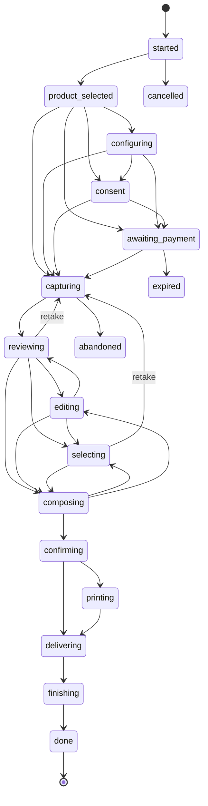

# Protocolo `station.v1` · kiosco ↔ agente

Protocolo entre el kiosco (`apps/kiosk`) y el agente de estación (`apps/station-agent`) bajo `/station/v1`, más el canal de eventos `GET /station/v1/events` (SSE). Toda forma de mensaje vive en `packages/contracts/src/station-api.ts`, con las entidades de sesión de `packages/contracts/src/sessions.ts`. Los ejemplos JSON validan contra los esquemas indicados en el comentario que los precede.

Principio (ADR-003): **el kiosco sólo habla con el agente local.** Nunca importa ni llama a la nube. El agente es la única fuente de verdad de la sesión en curso; nunca hay escritura remota directa sobre ella (docs/arquitectura/00-vision-general.md, principio 2).

## 1. Convenciones

| Aspecto | Regla |
|---|---|
| Base | `http://localhost:4100/station/v1` (el kiosco en desarrollo corre en `:5173` con proxy de Vite hacia `:4100`; en producción el agente sirve también los estáticos del kiosco) |
| Formato | JSON UTF-8, `Content-Type: application/json`; las fotografías viajan como `imageBase64` dentro del cuerpo, nunca como archivo aparte |
| Validación | El agente valida cada cuerpo con `safeParse` del esquema correspondiente; un cuerpo inválido responde `400` con `ApiError.code = "validation_error"` |
| Autenticación | Ninguna en las rutas de cliente: el agente sólo escucha en la máquina (localhost / red del dispositivo) y el kiosco es la única app que lo consume, por construcción (ADR-003). Las rutas `/tech/*` (salvo `/tech/login`) exigen `Authorization: Tech <token>` obtenido en el login del panel técnico |
| Tiempo | Toda marca es `Timestamp` (ISO 8601 con zona). `StationStatus.time` expone además `localTime` y `timezone` para que el kiosco muestre relojes y calcule ventanas sin volver a preguntar |
| Idempotencia de impresión | `PrintRequest.idempotencyKey` es obligatorio; reenviar la misma clave devuelve el `PrintJob` existente en vez de imprimir dos veces (requisito 32.3) |

### 1.1 Errores

<!-- contract: ApiError -->
```json
{
  "code": "session_not_found",
  "message": "La sesión ses_01J7Q9K3XA no existe o ya terminó.",
  "incidentCode": "ST-4M2A"
}
```

| `code` | HTTP | Cuándo |
|---|---|---|
| `validation_error` | 400 | El cuerpo no valida contra el esquema; `details` lleva el detalle de zod |
| `session_not_found` | 404 | `:id` no existe, o existe pero ya está en una etapa terminal y la ruta exige una sesión viva |
| `invalid_stage_transition` | 409 | `AdvanceStageRequest.to` no es alcanzable desde la etapa actual (`canTransition` de `@psp/domain` lo rechaza) |
| `capture_missing` | 404 | `:captureId` no existe en la sesión |
| `payment_intent_not_found` | 404 | `:id` de intento de pago inexistente |
| `printer_unavailable` | 409 | No hay impresora operativa del tipo requerido; ver `PrinterStatus` |
| `duplicate_print` | 200 | No es error: `idempotencyKey` repetida devuelve el `PrintJob` ya creado (§ impresión) |
| `ai_disabled` | 409 | `ai.experiences` no está `enabled` para la máquina |
| `tech_unauthorized` | 401 | Token de panel técnico ausente, inválido o vencido |
| `tech_invalid_pin` | 401 | `TechLoginRequest.pin` incorrecto |
| `conflict` | 409 | Acción incompatible con el estado actual (p. ej. `POST /sessions` con una sesión activa ya abierta) |

## 2. Rutas

| Método | Ruta | Cuerpo | Respuesta | Auth |
|---|---|---|---|---|
| GET | `/status` | — | `StationStatus` | ninguna |
| GET | `/bundle` | — | `KioskBundle` | ninguna |
| GET | `/assets/:hash` | — | bytes + `Content-Type` | ninguna |
| GET | `/events` | — | SSE de `StationEvent` | ninguna |
| POST | `/sessions` | `CreateSessionRequest` | `StationSession` | ninguna |
| GET | `/sessions/active` | — | `StationSession \| 204` | ninguna |
| GET | `/sessions/:id` | — | `StationSession` | ninguna |
| POST | `/sessions/:id/stage` | `AdvanceStageRequest` | `StationSession` | ninguna |
| POST | `/sessions/:id/consents` | `RecordConsentRequest` | `StationSession` | ninguna |
| POST | `/sessions/:id/captures` | `UploadCaptureRequest` | `Capture` | ninguna |
| DELETE | `/sessions/:id/captures/:captureId` | — | `StationSession` | ninguna |
| POST | `/sessions/:id/edits` | `SaveEditsRequest` | `StationSession` | ninguna |
| POST | `/sessions/:id/selection` | `SetSelectionRequest` | `StationSession` | ninguna |
| POST | `/sessions/:id/composition` | `SaveCompositionRequest` | `StationSession` | ninguna |
| POST | `/sessions/:id/print` | `PrintRequest` | `PrintJob` | ninguna |
| POST | `/sessions/:id/print/:jobId/retry` | — | `PrintJob` | ninguna |
| POST | `/sessions/:id/extend` | `ExtendSessionRequest` | `StationSession` | ninguna |
| POST | `/sessions/:id/cancel` | `CancelSessionRequest` | `StationSession` | ninguna |
| POST | `/sessions/:id/finish` | — | `FinishSessionResponse` | ninguna |
| GET | `/sessions/:id/files/:name` | — | bytes + `Content-Type` | ninguna |
| POST | `/payments/intents` | `CreatePaymentIntentRequest` | `PaymentIntent` | ninguna |
| POST | `/payments/intents/:id/cancel` | — | `PaymentIntent` | ninguna |
| POST | `/payments/simulate` | `SimulatePaymentRequest` | `PaymentIntent` | ninguna |
| POST | `/ai/jobs` | `AiJobRequest` | `AiJob` | ninguna |
| GET | `/ai/jobs/:id` | — | `AiJob` | ninguna |
| POST | `/delivery` | `DeliveryRequest` | `DeliveryRequestRecord` | ninguna |
| POST | `/tech/login` | `TechLoginRequest` | `TechLoginResponse` | ninguna |
| GET | `/tech/status` | — | `TechStatus` | Tech |
| POST | `/tech/tests` | `RunTestRequest` | `TestResult` | Tech |
| POST | `/tech/maintenance` | `MaintenanceActionRequest` | `TechStatus` | Tech |
| PATCH | `/tech/config` | `LocalConfigPatchRequest` | `EffectiveConfig` | Tech |
| POST | `/tech/simulate` | `SimulateFaultRequest` | `StationStatus` | Tech |
| POST | `/tech/print-test` | — | `PrintJob` | Tech |

### 2.1 `GET /status`

Lo que el kiosco consulta al arrancar y mientras está en atracción; también llega por SSE (`StationEvent` tipo `status`) para no tener que preguntar.

<!-- contract: StationStatus -->
```json
{
  "apiVersion": "station.v1",
  "machineId": "mch_demo_doc_01",
  "machineCode": "DOC-01",
  "machineName": "Estación documental 01",
  "organizationId": "org_lumina",
  "status": "active",
  "cloudReachable": true,
  "lastSyncAt": "2026-09-09T14:30:05Z",
  "bundleVersion": "d8832a1b44e0743b0465f2c7daa51efa12d7c5538fbc27240b46adaeb465ab87",
  "softwareVersion": "0.4.2",
  "maintenance": { "on": false },
  "capabilities": [
    { "key": "camera.primary", "present": true, "operational": true },
    { "key": "printer.photo", "present": true, "operational": true }
  ],
  "printers": [
    { "id": "prn_photo_1", "name": "Impresora fotográfica", "type": "photo", "paperSizes": ["4x6in", "5x7in"], "color": true, "consumableType": "photo_paper", "priority": 0, "status": "ready", "paperEstimate": 212 }
  ],
  "paymentTerminal": { "adapter": "mock", "status": "ready" },
  "storage": { "freeMb": 51200, "usedPct": 22.4 },
  "time": { "now": "2026-09-09T14:30:05Z", "timezone": "America/Mexico_City", "localTime": "08:30" },
  "activeSessionId": "ses_01J7Q9K3XA",
  "demoMode": false,
  "notices": [],
  "pendingEvents": 0
}
```

### 2.2 `GET /bundle`

Vista del bundle activo lista para renderizar: el `ConfigBundle` (§6 de `docs/protocolos/fleet-sync-v1.md`) más disponibilidad calculada y la base para resolver activos.

<!-- contract: KioskBundle -->
```json
{
  "version": "d8832a1b44e0743b0465f2c7daa51efa12d7c5538fbc27240b46adaeb465ab87",
  "contractsVersion": "v1",
  "machineId": "mch_demo_doc_01",
  "organizationId": "org_lumina",
  "generatedAt": "2026-09-09T14:29:30Z",
  "basedOn": { "layerIds": ["cfg_platform", "cfg_org_lumina"], "campaignIds": [], "catalogRevision": "cat_000123" },
  "organization": { "id": "org_lumina", "name": "Lumina", "slug": "lumina", "currency": "MXN", "defaultLocale": "es", "locales": ["es", "en"], "timezone": "America/Mexico_City", "country": "MX", "support": {} },
  "machine": { "id": "mch_demo_doc_01", "code": "DOC-01", "name": "Estación documental 01", "timezone": "America/Mexico_City", "releaseChannel": "stable", "printers": [] },
  "hardwareProfile": { "id": "hwp_doc_station", "name": "Estación documental", "camera": { "type": "usb_webcam", "count": 1, "resolution": { "width": 1920, "height": 1080 }, "orientation": "landscape" }, "printers": [], "paperSizes": ["4x6in"], "display": { "touch": true, "resolution": { "width": 1080, "height": 1920 }, "orientation": "portrait" }, "lighting": true, "storageMinGb": 64, "peripherals": [], "paymentReader": true, "audio": true, "sensors": [], "expectedCapabilities": ["camera.primary"], "version": 1, "createdAt": "2026-01-15T00:00:00Z" },
  "effective": { "values": {}, "provenance": {}, "locks": {}, "rejected": [], "hash": "3f0a9c2d5e7b1a4c6d8e0f2a4b6c8d0e1f3a5b7c9d1e3f5a7b9c1d3e5f7a9b1c" },
  "products": [],
  "prices": [],
  "promotions": [],
  "presets": [],
  "presetVersions": [],
  "templates": [],
  "experiences": [],
  "editingPresets": [],
  "campaigns": [],
  "features": [{ "key": "documents.mode", "mode": "enabled", "source": "default" }],
  "retentionPolicies": [],
  "maintenanceChecklists": [],
  "assets": [],
  "availability": [
    { "productId": "prd_doc_credencial", "available": true, "presentation": "show", "reasons": [] },
    { "productId": "prd_ia_anime", "available": false, "presentation": "coming_soon", "reasons": ["feature_coming_soon"] }
  ],
  "assetBaseUrl": "/station/v1/assets"
}
```

`assetBaseUrl` es el prefijo con el que el kiosco construye la URL de cada activo del manifiesto (`assetBaseUrl + '/' + hash`); el agente los sirve desde su propia caché (`GET /assets/:hash`, la misma semántica de content-addressing que `fleet.v1` §2.4), así que el kiosco nunca depende de la nube para pintar una pantalla.

### 2.3 Sesión: creación, avance y recuperación

<!-- contract: CreateSessionRequest -->
```json
{ "productId": "prd_tira_amigos", "locale": "es", "isDemo": false, "operatorStarted": false, "accessible": false }
```

Crea la sesión en `started` y la avanza de inmediato a `product_selected` (la única salida de `started`, automática porque `productId` ya llegó en la petición). El agente calcula `timers` con `computeTimers`, resuelve `commercial.paymentState` inicial con `initialPaymentState` (§9) y `retention` con `resolveRetentionPolicy`. Con una sesión activa ya abierta, responde `409 conflict`: sólo hay una sesión a la vez por máquina.

<!-- contract: StationSession -->
```json
{
  "id": "ses_01J7Q9K3XA",
  "code": "M4T7QP",
  "stage": "reviewing",
  "startedAt": "2026-09-09T15:00:00Z",
  "updatedAt": "2026-09-09T15:03:40Z",
  "locale": "es",
  "product": {
    "id": "prd_tira_amigos",
    "organizationId": "org_lumina",
    "internalName": "tira_amigos_std",
    "displayName": { "es": "Tira de fotos con amigos", "en": "Friends photo strip" },
    "category": "photo_strip",
    "kind": "entertainment",
    "description": { "es": "Cuatro poses divertidas en una tira clásica." },
    "whatYouGet": { "es": "Una tira impresa de 4 fotos." },
    "estimatedDurationSec": 150,
    "captureCount": 4,
    "printCount": 1,
    "output": { "templateId": "tpl_strip_2x6", "paperSize": "2x6in-strip", "copies": 1 },
    "experienceId": "exp_best_friends",
    "editing": { "enabled": true, "allowedTools": ["frames", "stickers", "text", "filterIntensity"], "allowedPresetIds": ["edp_vivid"] },
    "retakes": { "max": 2, "perPhoto": true, "wholeSession": false, "keepPreviousForCompare": true },
    "autoCapture": false,
    "manualCapture": true,
    "basePrice": { "amount": 6000, "currency": "MXN" },
    "hardwareRequirements": ["camera.primary", "printer.photo"],
    "requiredFeatures": ["entertainment.mode"],
    "schedule": [],
    "timing": {},
    "status": "active",
    "priority": 100,
    "tags": ["friends"],
    "createdAt": "2026-01-15T00:00:00Z"
  },
  "templateId": "tpl_strip_2x6",
  "templateVersion": 2,
  "experienceId": "exp_best_friends",
  "bundleVersion": "d8832a1b44e0743b0465f2c7daa51efa12d7c5538fbc27240b46adaeb465ab87",
  "captures": [
    { "id": "cap_1", "index": 0, "takenAt": "2026-09-09T15:01:10Z", "width": 1920, "height": 1080, "url": "/station/v1/sessions/ses_01J7Q9K3XA/files/cap_1.jpg", "selected": false, "auto": false },
    { "id": "cap_2", "index": 1, "takenAt": "2026-09-09T15:01:40Z", "width": 1920, "height": 1080, "url": "/station/v1/sessions/ses_01J7Q9K3XA/files/cap_2.jpg", "selected": false, "auto": false },
    { "id": "cap_3b", "index": 2, "takenAt": "2026-09-09T15:02:20Z", "width": 1920, "height": 1080, "url": "/station/v1/sessions/ses_01J7Q9K3XA/files/cap_3b.jpg", "retakeOf": "cap_3", "selected": false, "auto": false },
    { "id": "cap_4", "index": 3, "takenAt": "2026-09-09T15:02:50Z", "width": 1920, "height": 1080, "url": "/station/v1/sessions/ses_01J7Q9K3XA/files/cap_4.jpg", "selected": false, "auto": false }
  ],
  "retakesUsed": 1,
  "edits": {},
  "editingToolsUsed": [],
  "selection": [],
  "copies": 1,
  "printJobs": [],
  "payment": {
    "id": "pay_01J7Q9K1AA",
    "sessionId": "ses_01J7Q9K3XA",
    "amount": { "amount": 6000, "currency": "MXN" },
    "state": "approved",
    "adapter": "mock",
    "ref": "mock-000456",
    "createdAt": "2026-09-09T15:00:05Z",
    "updatedAt": "2026-09-09T15:00:22Z"
  },
  "commercial": { "state": "paid_simulated", "listPrice": { "amount": 6000, "currency": "MXN" }, "finalPrice": { "amount": 6000, "currency": "MXN" }, "promotionIds": [], "paymentState": "approved", "paymentRef": "mock-000456", "adapter": "mock" },
  "consents": [{ "kind": "service", "given": true, "at": "2026-09-09T15:00:00Z", "textVersion": "privacy-es-2026-03" }],
  "aiJobs": [],
  "deliveries": [],
  "timers": { "idleTimeoutSec": 60, "warningBeforeCancelSec": 15, "captureCountdownSec": 3, "prepareBeforeCaptureSec": 2, "reviewTimeoutSec": 90, "autoCaptureStabilityMs": 1200, "paymentTimeoutSec": 90 },
  "retention": { "policyId": "ret_delete_on_finish", "customerText": { "es": "Tus fotos se procesan en esta máquina y se eliminan al terminar la sesión." } },
  "errors": [],
  "isDemo": false,
  "operatorStarted": false
}
```

`GET /sessions/active` devuelve exactamente esta forma (o `204` sin cuerpo si no hay sesión viva). Es la ruta de recuperación: el kiosco la llama al montar la aplicación y, si hay sesión, salta directo a la pantalla de `stage` en vez de mostrar atracción (detalle de los 7 casos de recuperación en `docs/arquitectura/03-sesiones-y-privacidad.md`).

<!-- contract: AdvanceStageRequest -->
```json
{ "to": "capturing", "reason": "consent_given" }
```

Motor genérico de avance manual: el agente comprueba `canTransition(session.stage, to)` (`SESSION_TRANSITIONS` de `@psp/domain`, §3) y responde `409 invalid_stage_transition` si no es alcanzable. Es la ruta que usa el kiosco para las transiciones que no llevan cuerpo propio (`configuring→consent`, `…→awaiting_payment`, `reviewing→editing/selecting/composing`, vueltas atrás, etc.).

<!-- contract: RecordConsentRequest -->
```json
{ "consents": [{ "kind": "service", "given": true, "at": "2026-09-09T15:00:00Z", "textVersion": "privacy-es-2026-03" }] }
```

### 2.4 Capturas

<!-- contract: UploadCaptureRequest -->
```json
{
  "index": 2,
  "imageBase64": "data:image/jpeg;base64,/9j/4AAQSkZJRgABAQAAAQABAAD...",
  "width": 1920,
  "height": 1080,
  "retakeOf": "cap_3",
  "auto": false,
  "analysis": { "faces": 1, "passed": ["face.detected", "framing"], "warnings": [], "blocked": [], "sharpness": 62.4, "brightness": 0.58 }
}
```

<!-- contract: Capture -->
```json
{ "id": "cap_3b", "index": 2, "takenAt": "2026-09-09T15:02:20Z", "width": 1920, "height": 1080, "url": "/station/v1/sessions/ses_01J7Q9K3XA/files/cap_3b.jpg", "retakeOf": "cap_3", "selected": false, "auto": false }
```

El agente decodifica `imageBase64`, la escribe en `var/station/<machineId>/sessions/<id>/` y devuelve la `Capture` con `url` apuntando a `GET /sessions/:id/files/:name` (§6). `DELETE /sessions/:id/captures/:captureId` borra el archivo y la entrada; se usa para descartar un retake sin dejarlo en `retakesUsed` visible en la revisión final.

### 2.5 Edición, selección y composición

<!-- contract: SaveEditsRequest -->
```json
{ "captureId": "cap_1", "ops": [{ "op": "brightness", "params": { "amount": 0.1 } }, { "op": "frame", "params": { "assetId": "ast_frame_navidad" } }], "toolsUsed": ["brightness", "frames"] }
```

`ops` es la lista que `@psp/imaging` aplica con `applyEditOps`; `resultBase64` es opcional porque el kiosco puede pedirle al agente que re-renderice o enviar ya el resultado calculado en el propio canvas. Documentos sólo aceptan herramientas de `DOCUMENT_SAFE_TOOLS`; el agente valida con `validateEditOps` y responde `422` (dentro de `validation_error`) listando las operaciones rechazadas.

<!-- contract: SetSelectionRequest -->
```json
{ "captureIds": ["cap_1", "cap_2", "cap_4"] }
```

<!-- contract: SaveCompositionRequest -->
```json
{ "imageBase64": "data:image/png;base64,iVBORw0KGgoAAAANSUhEUgAA...", "width": 1800, "height": 5400, "copies": 1 }
```

### 2.6 Impresión

<!-- contract: PrintRequest -->
```json
{ "copies": 1, "printerId": "prn_photo_1", "idempotencyKey": "ses_01J7Q9K3XA:print:1" }
```

<!-- contract: PrintJob -->
```json
{
  "id": "prj_01J7Q9K9ZZ",
  "sessionId": "ses_01J7Q9K3XA",
  "machineId": "mch_demo_doc_01",
  "printerId": "prn_photo_1",
  "copies": 1,
  "status": "printing",
  "attempt": 1,
  "idempotencyKey": "ses_01J7Q9K3XA:print:1",
  "isTest": false,
  "createdAt": "2026-09-09T15:04:10Z"
}
```

Reenviar `POST /sessions/:id/print` con la misma `idempotencyKey` no crea un segundo trabajo: devuelve el `PrintJob` existente (requisito 32.3, mismo mecanismo que protege contra un doble toque en "imprimir"). `POST /sessions/:id/print/:jobId/retry` sólo es válido sobre un trabajo en `failed`; sube `attempt` y reintenta en la impresora prioritaria disponible.

### 2.7 Extensión, cancelación y cierre

<!-- contract: ExtendSessionRequest -->
```json
{ "extraSec": 30 }
```

<!-- contract: CancelSessionRequest -->
```json
{ "reason": "customer_left" }
```

`POST /sessions/:id/finish` no lleva cuerpo: cierra la sesión en curso (`finishing → done`), aplica la política de retención y devuelve:

<!-- contract: FinishSessionResponse -->
```json
{
  "session": { "...": "StationSession con stage: \"done\"" },
  "record": {
    "id": "ses_01J7Q9K3XA",
    "code": "M4T7QP",
    "machineId": "mch_demo_doc_01",
    "organizationId": "org_lumina",
    "startedAt": "2026-09-09T15:00:00Z",
    "endedAt": "2026-09-09T15:06:12Z",
    "stage": "done",
    "result": "completed",
    "productId": "prd_tira_amigos",
    "productName": "Tira de fotos con amigos",
    "productKind": "entertainment",
    "templateId": "tpl_strip_2x6",
    "templateVersion": 2,
    "experienceId": "exp_best_friends",
    "captures": 4,
    "retakes": 1,
    "printsRequested": 1,
    "printsCompleted": 1,
    "durationSec": 372,
    "commercial": { "state": "paid_simulated", "listPrice": { "amount": 6000, "currency": "MXN" }, "finalPrice": { "amount": 6000, "currency": "MXN" }, "promotionIds": [], "paymentState": "approved", "paymentRef": "mock-000456", "adapter": "mock" },
    "softwareVersion": "0.4.2",
    "bundleVersion": "d8832a1b44e0743b0465f2c7daa51efa12d7c5538fbc27240b46adaeb465ab87",
    "errors": [],
    "consents": [{ "kind": "service", "given": true, "at": "2026-09-09T15:00:00Z", "textVersion": "privacy-es-2026-03" }],
    "retention": { "policyId": "ret_delete_on_finish", "mode": "none", "deleteAt": "2026-09-09T15:06:12Z", "deletedAt": "2026-09-09T15:06:13Z" },
    "isDemo": false,
    "operatorStarted": false,
    "locale": "es",
    "editingUsed": true,
    "editingTools": ["brightness", "frames"]
  },
  "retentionNotice": { "es": "Tus fotos se eliminaron de esta máquina. Sólo se guardó el registro de la venta." }
}
```

`record` es exactamente lo que después viaja a la nube como evento `session_record` de `fleet.v1` (mismo esquema, `SessionRecord`, sin fotografías). La pantalla de finalización del kiosco muestra `retentionNotice` (requisito 23.5).

### 2.8 Pagos, IA y entrega

<!-- contract: CreatePaymentIntentRequest -->
```json
{ "sessionId": "ses_01J7Q9K3XA" }
```

<!-- contract: SimulatePaymentRequest -->
```json
{ "intentId": "pay_01J7Q9K1AA", "outcome": "approve" }
```

Sólo responde en máquinas con `payment.terminalAdapter` en un adaptador de prueba (`mock`, o cualquiera vía panel técnico): dispara el mismo evento que dispararía el hardware real (`approve`, `decline`, `cancel`, `expire`, `review`, `device_out`, `recover`) sobre la máquina de pagos pura de `@psp/integrations` (§9).

<!-- contract: AiJobRequest -->
```json
{ "sessionId": "ses_01J7Q9K3XA", "captureId": "cap_1", "experience": "stylize", "consent": { "kind": "external_future", "given": true, "at": "2026-09-09T15:03:00Z", "textVersion": "ai-consent-es-2026-03" } }
```

<!-- contract: AiJob -->
```json
{ "id": "job_01J7Q9K5CC", "sessionId": "ses_01J7Q9K3XA", "captureId": "cap_1", "experience": "stylize", "state": "coming_soon", "provider": "external_stub", "message": { "es": "Esta función llega próximamente." }, "createdAt": "2026-09-09T15:03:00Z", "updatedAt": "2026-09-09T15:03:00Z" }
```

<!-- contract: DeliveryRequest -->
```json
{ "sessionId": "ses_01J7Q9K3XA", "channel": "whatsapp", "destination": "+52 55 0000 0000" }
```

### 2.9 Panel técnico (requisito 12)

`POST /tech/login` valida `techPanel.pinHash` del efectivo de la máquina y devuelve un token corto (guardado en memoria del kiosco, nunca en `localStorage`).

<!-- contract: TechLoginRequest -->
```json
{ "pin": "4821" }
```

<!-- contract: TechLoginResponse -->
```json
{ "token": "tech_9f1c2e4b7a3d5f6e8091", "expiresAt": "2026-09-09T16:00:00Z" }
```

`GET /tech/status` (`TechStatus`) agrega `StationStatus` con la ubicación, un resumen del efectivo, sesiones y eventos recientes, resultados de prueba, overrides locales y estado del outbox — todo lo que el técnico necesita sin salir de la máquina.

<!-- contract: RunTestRequest -->
```json
{ "kind": "print" }
```

<!-- contract: TestResult -->
```json
{ "kind": "print", "ok": true, "message": "Patrón de prueba impreso en prn_photo_1.", "at": "2026-09-09T16:01:00Z" }
```

`TechTestKind`: `camera`, `preview`, `capture`, `print`, `lighting`, `touch`, `audio`, `storage`, `network`, `demo_session`, `composition`. Las de navegador (`camera`, `preview`, `capture`, `touch`) el agente las delega al kiosco por SSE (`StationEvent` tipo `command`) porque sólo el navegador tiene acceso a `getUserMedia` y a la pantalla táctil.

`MaintenanceActionRequest` es una unión discriminada por `action`:

| `action` | Campos | Efecto |
|---|---|---|
| `out_of_service` | `message?` | `status → out_of_service`; el kiosco muestra la pantalla de fuera de servicio |
| `back_in_service` | — | `status → active` |
| `maintenance_on` / `maintenance_off` | `message?` | Igual que el comando de flota `set_maintenance`, pero iniciado localmente |
| `clear_temp_sessions` | — | Elimina sesiones no activas con retención vencida o incompletas |
| `paper_changed` | `printerId`, `qty` | Registra cambio de consumible; emite `MachineEvent` `paper_low`→resuelto y `local_audit` |
| `log_maintenance` | `type`, `checklistId?`, `results[]`, `notes?` | Crea `MaintenanceLog` |
| `open_incident` | `severity`, `category`, `title`, `description?` | Crea `Incident` con `source: "manual"` |
| `close_incident` | `incidentId`, `resolution` | Cierra la incidencia |
| `set_demo_mode` | `on` | `demoMode` de `StationStatus` |
| `sync_now` | — | Fuerza heartbeat + vaciado de outbox inmediato |

<!-- contract: MaintenanceActionRequest -->
```json
{ "action": "paper_changed", "printerId": "prn_photo_1", "qty": 400 }
```

<!-- contract: LocalConfigPatchRequest -->
```json
{ "values": { "kiosk.screenBrightness": 65 }, "reason": "Reflejo de sol en la tarde" }
```

Sólo acepta claves cuya definición admite `machine` en `editableAt` y que no estén bloqueadas por un nivel superior (`packages/config-engine`); lo demás se rechaza igual que rechazaría el motor. Responde el nuevo `EffectiveConfig` de la máquina.

`SimulateFaultRequest` (sólo panel técnico, para probar la UI sin hardware real):

| `fault` | Campos | Efecto |
|---|---|---|
| `printer_no_paper` / `printer_jam` / `printer_ok` | `printerId` | Cambia `PrinterRuntime.status` |
| `camera_off` / `camera_on` | — | Cambia `MachineCapabilityState` de `camera.primary` |
| `cloud_off` / `cloud_on` | — | Fuerza `cloudReachable` sin esperar al backoff real |
| `storage_low` / `storage_ok` | — | Cambia `StationStatus.storage` |
| `payment_device_out` / `payment_device_ok` | — | Aplica `device_out` / `device_ok` a la terminal de pago mock |

<!-- contract: SimulateFaultRequest -->
```json
{ "fault": "printer_no_paper", "printerId": "prn_photo_1" }
```

`POST /tech/print-test` imprime el patrón de prueba (`PrintJob.isTest = true`) sin pasar por una sesión.

## 3. Ciclo de sesión etapa por etapa

`SessionStage` y su grafo de transiciones viven en `@psp/domain` (`SESSION_TRANSITIONS`, construido sobre `FLOW`). Desde cualquier etapa no terminal, el agente acepta además cancelar, fallar, expirar o abandonar.



*(el diagrama omite, por legibilidad, que cancelar/fallar/expirar/abandonar es válido desde cualquier etapa no terminal, no sólo desde las dibujadas).*

| Etapa | Qué la produce |
|---|---|
| `started` → `product_selected` | Automático al crear la sesión (`POST /sessions`); `productId` ya viene en la petición |
| `configuring` | `POST /sessions/:id/stage {to: "configuring"}` — el kiosco muestra opciones del producto (copias, variante) cuando las hay |
| `consent` | `POST /sessions/:id/stage {to: "consent"}`, seguido de `POST /sessions/:id/consents` para registrar la decisión |
| `awaiting_payment` | `POST /sessions/:id/stage {to: "awaiting_payment"}` cuando `product.basePrice` y `payment.businessMode` lo requieren; el pago en sí usa `/payments/intents` (§9) |
| `capturing` | `POST /sessions/:id/stage {to: "capturing"}`; cada toma es `POST /sessions/:id/captures` hasta cubrir `product.captureCount` (más retakes dentro de `retakes.max`) |
| `reviewing` | Automático al completar `captureCount` capturas, o `POST /sessions/:id/stage` explícito |
| `editing` | Sólo si `product.editing.enabled`; `POST /sessions/:id/edits` uno o más veces |
| `selecting` | Sólo si `product.kind !== "document"` y `captureCount > 1`; `POST /sessions/:id/selection` |
| `composing` | `POST /sessions/:id/composition` con el resultado renderizado por `@psp/imaging` en el propio kiosco |
| `confirming` | El kiosco muestra la vista previa final antes de comprometerse a imprimir/entregar |
| `printing` | Sólo si `product.printCount > 0`; `POST /sessions/:id/print` |
| `delivering` | Entrega digital si se pidió (`POST /delivery`); si no aplica, se cruza sin acción del cliente |
| `finishing` → `done` | `POST /sessions/:id/finish` |
| `cancelled` | `POST /sessions/:id/cancel` (motivo del cliente o del kiosco) |
| `failed` / `expired` / `abandoned` | El agente las asigna internamente: error irrecuperable, `idleTimeoutSec` agotado sin `extend`, o cierre forzado (nunca las pide el kiosco por `/stage`) |

`stagesForProduct` (`@psp/domain`) calcula, para un producto dado, el subconjunto y orden exacto de estas etapas (sin `selecting` en documentos, sin `printing` si `printCount` es 0, etc.); esta tabla documenta el mapeo a rutas, no sustituye esa función.

## 4. Recuperación tras recarga

El kiosco no guarda estado de sesión propio: al montar, siempre llama `GET /sessions/active`. Con `204`, muestra atracción. Con una `StationSession`, renderiza directamente la pantalla de `stage` — el cliente nunca ve un "iniciar de nuevo" si el agente sigue teniendo su sesión. Esto cubre recargas del navegador, refrescos de PWA y el propio inicio del agente después de un corte de energía (los 7 casos de recuperación de sesión, con su resolución completa, están en `docs/arquitectura/03-sesiones-y-privacidad.md`).

## 5. Temporizadores

`SessionTimers` los calcula el agente (`computeTimers` de `@psp/domain`) a partir del efectivo de la máquina y de `product.timing`, y viajan dentro de `StationSession.timers`. El kiosco sólo **muestra** (`Countdown`, `TimeoutBar`, `ProgressDots` de `@psp/ui`); nunca decide por su cuenta que una sesión terminó.

| Campo | Quién actúa |
|---|---|
| `idleTimeoutSec` | El agente cierra la sesión (`expired`) si no llega ninguna petición sobre ella en ese lapso; el kiosco muestra la cuenta regresiva y, a `warningBeforeCancelSec` del límite, un aviso con opción de `POST /sessions/:id/extend` |
| `warningBeforeCancelSec` | Sólo visual: umbral en el que el kiosco pinta el aviso |
| `captureCountdownSec` / `prepareBeforeCaptureSec` | El kiosco los usa para su cuenta regresiva de captura; no cierran nada por sí mismos |
| `reviewTimeoutSec` | Igual que `idleTimeoutSec` pero acotado a la etapa `reviewing` |
| `autoCaptureStabilityMs` | Lo consume `AutoCaptureController` de `@psp/vision` en el propio kiosco |
| `paymentTimeoutSec` | El intento de pago expira (`PaymentState` → `expired`, §9) si nadie paga a tiempo |

`POST /sessions/:id/extend` acepta `extraSec` entre 1 y 600 y sólo tiene efecto sobre el temporizador de la etapa activa; con `accessible: true` en `CreateSessionRequest`, todos los tiempos de espera del cliente ya nacen multiplicados por `kiosk.accessibleTimeoutMultiplier` (requisito de accesibilidad, `computeTimers`).

## 6. Por qué las fotografías van al agente en base64 y nunca a la nube

`UploadCaptureRequest.imageBase64`, `SaveEditsRequest.resultBase64` y `SaveCompositionRequest.imageBase64` son la única forma en que una imagen entra al sistema: el navegador la produce con `getUserMedia` + canvas y la manda, codificada, al agente que corre en la misma máquina. El agente la decodifica y la escribe bajo `var/station/<machineId>/sessions/<sessionId>/`; todo lo que el kiosco vuelve a leer (`Capture.url`, `Capture.editedUrl`, la composición) es una ruta servida por `GET /sessions/:id/files/:name`, resuelta dentro de la propia máquina.

Nada de esto sale del dispositivo: `SessionRecord` (lo único que via `fleet.v1` llega a la nube, ver `docs/protocolos/fleet-sync-v1.md` §5) no tiene ningún campo de imagen, y `PrintJob.outputPath` se descarta explícitamente antes de convertirse en evento (`FleetEvent` tipo `print_job` usa `PrintJob.omit({ outputPath: true })`). Es la aplicación directa de ADR-003 y ADR-005: visión y edición ocurren en el dispositivo porque ahí es donde vive la fotografía, nunca al revés.

## 7. Eventos en vivo (`GET /events`, SSE)

`StationEvent` es una unión discriminada por `type`. El agente la emite cada vez que algo cambia sin esperar a que el kiosco pregunte:

| `type` | Cuándo se emite |
|---|---|
| `status` | Cambia cualquier campo visible de `StationStatus` (conectividad, mantenimiento, batería de eventos pendientes…) |
| `bundle_changed` | Al activar un bundle nuevo (§6 de `fleet-sync-v1.md`); el kiosco lo aplica al volver a atracción, nunca a media sesión |
| `printer` | Cambia el estado de una impresora (`PrinterStatus`): sin papel, atascada, lista de nuevo |
| `print_job` | Cada transición de un `PrintJob` de la sesión activa |
| `payment` | Cada transición de un `PaymentIntent` (§9); así el kiosco refleja `initiated`/`approved`/`declined` sin sondear |
| `session` | La sesión activa cambió (cualquier campo); es el mecanismo con el que dos pestañas o un panel técnico observando en paralelo se mantienen sincronizados |
| `maintenance` | Entra o sale de modo mantenimiento, local o por comando de flota |
| `ai_job` | Cada transición de un `AiJob` (§10) |
| `command` | Delegación de una prueba de panel técnico que sólo el navegador puede ejecutar (`camera`, `preview`, `capture`, `touch`) |
| `machine_event` | Cualquier `MachineEvent` operativo, para paneles de diagnóstico embebidos en el propio kiosco |

## 8. Estados de pago (`PaymentState`) y qué muestra el kiosco

La máquina de estados pura vive en `@psp/integrations` (`nextPaymentState`, `PAYMENT_TRANSITIONS`); el agente sólo la invoca. `initialPaymentState` decide el estado de nacimiento según `payment.businessMode`, si la sesión es demo o iniciada por operador, y el estado de la terminal:

| Estado inicial | Cuándo |
|---|---|
| `demo` | Sesión demo o `businessMode = "demo"` |
| `operator_started` | `CreateSessionRequest.operatorStarted = true` |
| `not_required` | `businessMode` en `internal` o `included` |
| `free` | `businessMode ≠ "paid"`, o `basePrice.amount ≤ 0` |
| `unavailable` | `businessMode = "paid"` y la terminal está `not_configured` |
| `device_out_of_service` | Terminal `out_of_service` u `offline` |
| `awaiting` | `businessMode = "paid"` y terminal lista: el kiosco puede crear el intento |

Transiciones desde un intento activo (`PAYMENT_TRANSITIONS`):

| Desde | Evento | A | Pantalla del kiosco |
|---|---|---|---|
| `awaiting` | `start` | `initiated` | "Sigue las instrucciones en el lector" |
| `awaiting` / `initiated` | `approve` | `approved` | Pantalla de éxito; la sesión avanza más allá de `awaiting_payment` |
| `awaiting` / `initiated` | `decline` | `declined` | "Pago rechazado", con opción de reintentar (`retry → awaiting`) |
| `awaiting` / `initiated` | `cancel` | `cancelled` | El cliente vuelve atrás; `retry → awaiting` si quiere intentar de nuevo |
| `awaiting` / `initiated` | `expire` | `expired` | `paymentTimeoutSec` agotado; mismo `retry` disponible |
| `awaiting` / `initiated` | `review` | `under_review` | "Verificando el pago"; sólo puede resolver en `approved`/`declined` |
| `awaiting` / `initiated` | `device_out` | `device_out_of_service` | "Terminal no disponible"; `device_ok` la regresa a `awaiting` |
| `declined` / `cancelled` / `expired` | `retry` | `awaiting` | Vuelve a la pantalla de pago |
| `approved`, `not_required`, `free`, `demo`, `operator_started` | — | (terminales) | La sesión no vuelve a tocar el pago |

`SimulatePaymentRequest.outcome` dispara exactamente estos eventos sobre el terminal mock (§2.8); un terminal real (`docs/arquitectura/05-evolucion-y-nube.md`) los produce a partir de lo que reporte el hardware, pero la tabla de estados no cambia.

## 9. Estados de IA (`AiJobState`)

`ai.experiences` nace en modo `coming_soon` (`FEATURE_DEFINITIONS`, `packages/contracts/src/features.ts`): no hay proveedor real conectado (ADR-006). `AiJobRequest` siempre produce un `AiJob`, para que la UI represente el estado aunque no haya proveedor:

| Estado | Cuándo | Pantalla del kiosco |
|---|---|---|
| `coming_soon` | Modo por defecto: el `ExternalAiProviderStub` responde así a todo | "Esta función llega próximamente" |
| `unavailable` | La feature está `hidden`/`locked` para la máquina, o falta `connectivity.online` | La opción ni se ofrece, o se ofrece bloqueada según `FeatureMode` (§7 de `01-apis-de-paquetes.md`) |
| `consent_required` | Falta el consentimiento `external_future` en la petición | El kiosco pide el consentimiento antes de reintentar |
| `processing` | Un adaptador real está trabajando (no ocurre hoy con el stub) | Spinner con tiempo estimado |
| `ready` | El resultado está disponible en `resultUrl` (local, misma regla del §6) | Vista de resultado |
| `retry` | Fallo transitorio del proveedor | El kiosco reintenta automáticamente una vez |
| `error` | Fallo no recuperable | "No se pudo procesar tu foto" con salida a la revisión normal |
| `rejected` | El proveedor rechazó la imagen (contenido, formato) | Mensaje específico, sin reintento automático |
| `disabled` | Un administrador apagó la feature explícitamente | Igual que `unavailable` |
